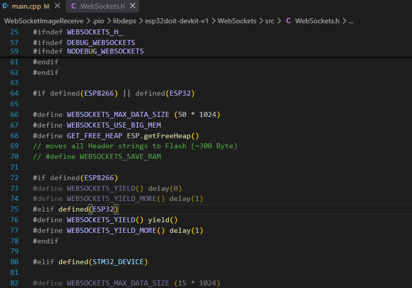
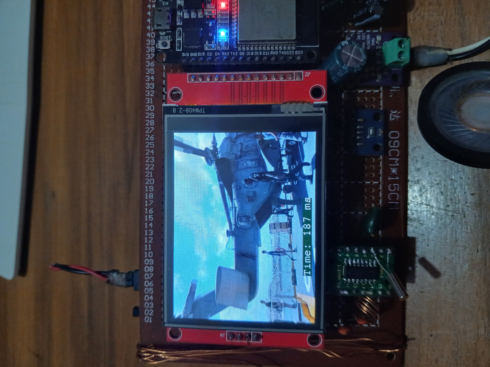

# Websocket Image Receive from PC

Need to change Websocket max data size to 35kb to 50kb, Otherwise it will crash randomly.


### Library needed
```
	bodmer/TFT_eSPI@^2.5.43
	bodmer/JPEGDecoder@^2.0.0
	gilmaimon/ArduinoWebsockets@^0.5.4
	bodmer/TJpg_Decoder@^1.1.0
	links2004/WebSockets@^2.7.3
```


## Yes Quality is Poatato!! Max 7-8 fps

